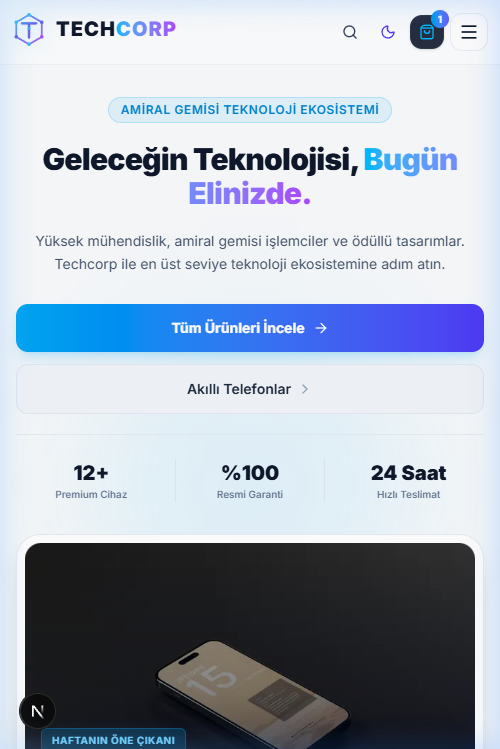
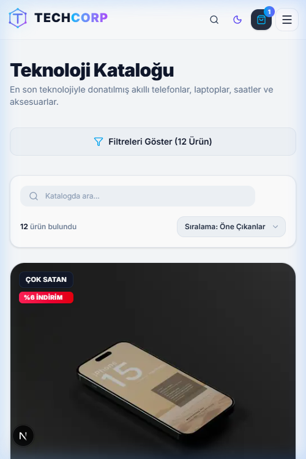
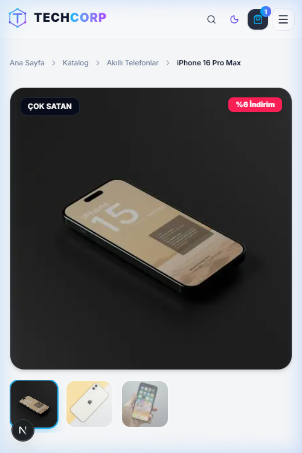
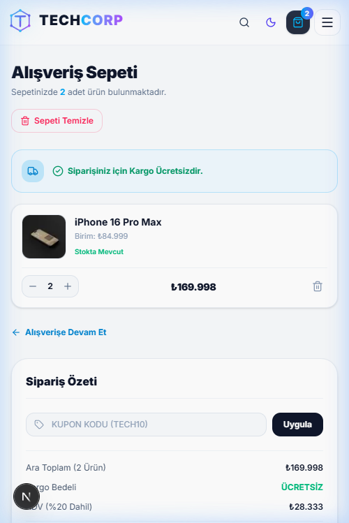

# 🚀 Techcorp — Premium Next-Gen E-Commerce Platform

<div align="center">


**En son web teknolojileriyle geliştirilmiş, ultra hızlı, kesintisiz ve şık premium e-ticaret deneyimi.**

[Canlı Demo](#-deployment-dağıtım-rehberi) • [Özellikler](#-öne-çıkan-özellikler) • [Teknoloji Seçimleri](#-kullanılan-teknolojiler-ve-tercih-sebepleri) • [Kurulum Rehberi](#-kurulum-ve-yerel-çalıştırma)

</div>

---

## 📸 Ekran Görüntüleri ve Arayüz Önizlemesi

Proje arayüzünden doğrudan alınmış ekran görüntüleri:

### 1. Ana Sayfa (Hero, Öne Çıkanlar & Vitrin)
*Fütüristik tasarım dili, gradient arka planlar, interaktif öne çıkan ürünler kaydırıcısı ve kategori kartları.*


---

### 2. Ürün Kataloğu ve Filtreleme
*Dinamik kategori geçişleri, anlık metin tabanlı ürün araması, fiyat ve puana göre sıralama sistemi.*


---

### 3. Ürün Detay Sayfası
*Çoklu galeri resim önizlemesi, detaylı donanım/teknik özellik tabloları, stok durumu ve sepete ekleme.*


---

### 4. Alışveriş Sepeti & Sipariş Özeti
*Dinamik miktar güncelleme, vergi ve kargo hesaplama, promosyon kodu alanı ve anlık LocalStorage/API senkronizasyonu.*


---

## 🌟 Öne Çıkan Özellikler

- ⚡ **Ultra Hızlı Next.js 16 & React 19 Mimarisi:** Server Components ve istemci optimizasyonlarıyla anında yüklenen sayfalar.
- 💎 **Premium Glassmorphism & Modern UI:** Tailwind CSS v4 ile kurgulanmış, karanlık mod esintili, canlı gradient geçişli lüks tasarım.
- 🛡️ **Hata Toleranslı Hibrit Veri Motoru (Resilient Architecture):** Backend API veya veritabanı kapalı olsa bile kullanıcıyı mağdur etmeyen, yerel statik yedek veri motoru (Mock Fallback).
- 🛒 **Gelişmiş Sepet Durum Yönetimi (State Management):** `CartContext` ile hem istemci tarafında `localStorage` senkronizasyonu hem de arka planda REST API sepet eşitlemesi.
- 🔍 **Gelişmiş Arama ve Filtreleme:** Kategori bazlı filtreleme, metin araması ve sıralama parametreleri (URL query params ile tam uyumlu).
- 📱 **Tam Duyarlı (100% Mobile Responsive):** Akıllı telefon, tablet ve geniş masaüstü ekranlarında kusursuz görünüm.

---

## 🛠️ Kullanılan Teknolojiler ve Tercih Sebepleri

### 1. Frontend (İstemci Mimarisi)

| Teknoloji | Sürüm | Neden Tercih Edildi? |
| :--- | :--- | :--- |
| **Next.js (App Router)** | `v16.3.5` | SEO uyumluluğu (SSR), Turbopack derleme hızı, optimize routing ve sıfır yapılandırmalı Vercel uyumu için tercih edildi. |
| **React** | `v19.2.8` | En güncel bileşen yaşam döngüsü optimizasyonları, gelişmiş concurrent rendering yetenekleri. |
| **Tailwind CSS** | `v4.0` | CSS dosya boyutunu minimuma indiren JIT derleyicisi, modern CSS değişkenleri ve fütüristik cam (glass) efektlerinin kolay inşası. |
| **TypeScript** | `v5.x` | Ürünler, sepet nesneleri ve API yanıtları için güçlü tip güvenliği sağlayarak çalışma zamanı hatalarını sıfıra indirmek amacıyla. |
| **Lucide React** | `^1.46.0` | Minimalist, modern ve yüksek performanslı SVG tabanlı arayüz ikonları. |

### 2. Backend (Sunucu Mimarisi)

| Teknoloji | Sürüm | Neden Tercih Edildi? |
| :--- | :--- | :--- |
| **Node.js & Express.js** | `v5.x` | Hafif, yüksek eşzamanlı istekleri kolayca yönetebilen, yaygın kabul görmüş standart RESTful API omurgası. |
| **MongoDB & Mongoose** | `v9.x` | E-ticaret ürün kataloglarının esnek veri şeması (özellikler, teknik tablolar, dinamik alanlar) gereksinimlerine mükemmel uyumu. |
| **CORS & Dotenv** | `Güncel` | Güvenli domainler arası iletişim (Cross-Origin Resource Sharing) ve gizli anahtarların çevre değişkenleriyle izolasyonu. |

### 3. Geliştirici Deneyimi (DevOps & DX)

- **Concurrently:** Geliştiricinin hem `client` hem de `server` dizinlerini ayrı terminaller açmak zorunda kalmadan, tek bir komutla (`npm run dev`) eş zamanlı çalıştırmasını sağlar.
- **Dinamik Fallback Altyapısı:** Geliştirici yerel MongoDB kurmak zorunda kalmadan doğrudan frontend geliştirmesi yapabilir.

---

## 📂 Proje Dizin Yapısı (Monorepo)

```text
TechcorpE-ticaret/
├── client/                     # Next.js 16 Frontend Uygulaması
│   ├── src/
│   │   ├── app/                # App Router Sayfaları
│   │   │   ├── page.tsx        # Ana Sayfa
│   │   │   ├── products/       # Ürün Kataloğu ve Filtreleme
│   │   │   │   └── [id]/       # Dinamik Ürün Detay Sayfası
│   │   │   ├── cart/           # Sepet Sayfası
│   │   │   ├── about/          # Hakkımızda Sayfası
│   │   │   └── contact/        # İletişim Sayfası
│   │   ├── components/         # Yeniden Kullanılabilir Bileşenler
│   │   │   ├── Navbar.tsx      # Navigasyon Çubuğu (Sepet Rozeti ile)
│   │   │   ├── Footer.tsx      # Alt Bilgi Bölümü
│   │   │   ├── ProductCard.tsx # Ürün Kartı Bileşeni
│   │   │   └── Toast.tsx       # Bildirim Bileşeni
│   │   ├── context/            # Global Durum Yönetimi (CartContext)
│   │   ├── lib/                # API İstemcisi & Statik Yedek Veriler
│   │   └── types/              # TypeScript Tip Tanımları (Product, Cart)
│   └── package.json
│
├── server/                     # Express.js REST API Backend
│   ├── config/                 # Veritabanı Bağlantısı (db.js)
│   ├── controllers/            # İstek Yöneticileri (productController, cartController)
│   ├── models/                 # Mongoose Veri Modelleri (Product, Cart)
│   ├── routes/                 # API Uç Noktaları (/api/products, /api/cart)
│   ├── seeds/                  # Başlangıç Mock Verileri (seed.js)
│   ├── server.js               # Sunucu Giriş Noktası
│   └── package.json
│
├── docs/                       # Ekran Görüntüleri ve Dokümantasyon
│   └── images/                 # README için yüksek çözünürlüklü görseller
├── package.json                # Monorepo Kök Scriptleri (Concurrently)
└── README.md
```

---

## 💻 Kurulum ve Yerel Çalıştırma

### Gereksinimler
- **Node.js**: `v18.18.0` veya üzeri
- **npm**: `v9.0.0` veya üzeri
- *(Opsiyonel)* Yerel **MongoDB** veya **MongoDB Atlas** bağlantısı

### 1. Projeyi Klonlayın
```bash
git clone https://github.com/cladiusweb/techcorp-e-commerce.git
cd techcorp-e-commerce
```

### 2. Bağımlılıkları Yükleyin
Kök dizinde, istemcide ve sunucuda paketleri kurun:
```bash
# Kök bağımlılıkları yükleyin
npm install

# Client bağımlılıklarını yükleyin
npm install --prefix client

# Server bağımlılıklarını yükleyin
npm install --prefix server
```

### 3. Ortam Değişkenlerini Tanımlayın (Opsiyonel)
- `client/.env.local`:
  ```env
  NEXT_PUBLIC_API_URL=http://localhost:5000/api
  ```
- `server/.env`:
  ```env
  PORT=5000
  MONGODB_URI=mongodb://127.0.0.1:27017/techcorp
  ```

### 4. Tek Komutla Başlatın
Tüm sistemi (Next.js + Express API) tek komutla aynı anda ayağa kaldırın:
```bash
npm run dev
```

Uygulamanız hazır:
- **Frontend (Web):** [http://localhost:3000](http://localhost:3000)
- **Backend (API):** [http://localhost:5000/api/health](http://localhost:5000/api/health)

*(İsteğe bağlı olarak MongoDB veritabanını örnek ürünlerle doldurmak için: `npm run seed`)*

---

## 🚀 Deployment (Dağıtım) Rehberi

### Frontend'i Vercel'e Dağıtma
1. [Vercel](https://vercel.com/new)'e gidin ve GitHub reponuzu seçin.
2. **Root Directory** ayarını **`client`** olarak belirleyin.
3. Framework olarak **Next.js** otomatik seçilecektir.
4. *(Varsa)* Environment Variables kısmına canlı backend URL'inizi ekleyin:
   `NEXT_PUBLIC_API_URL=https://sizin-api-adresiniz.com/api`
5. **Deploy** butonuna basın.

### Backend'i Render / Railway'e Dağıtma
1. [Render.com](https://render.com)'da yeni bir **Web Service** oluşturun.
2. **Root Directory:** `server`
3. **Build Command:** `npm install`
4. **Start Command:** `node server.js`
5. Environment Variables:
   - `MONGODB_URI`: MongoDB Atlas bağlantı cümleniz
   - `PORT`: `5000`

---

## 👨‍💻 Geliştirici & Katkıda Bulunma

Bu proje modern full-stack web mimarisini, temiz kodlama standartlarını ve yüksek kullanıcı deneyimi (UX) pratiklerini sergilemek amacıyla geliştirilmiştir.

- **Geliştirici:** [cladiusweb](https://github.com/cladiusweb)
- **Katkı:** Çekme istekleri (PR) memnuniyetle kabul edilir. Lütfen büyük değişiklikler yapmadan önce bir konu (issue) açarak tartışın.

---

## 📄 Lisans

Bu proje [MIT Lisansı](LICENSE) kapsamında lisanslanmıştır.
